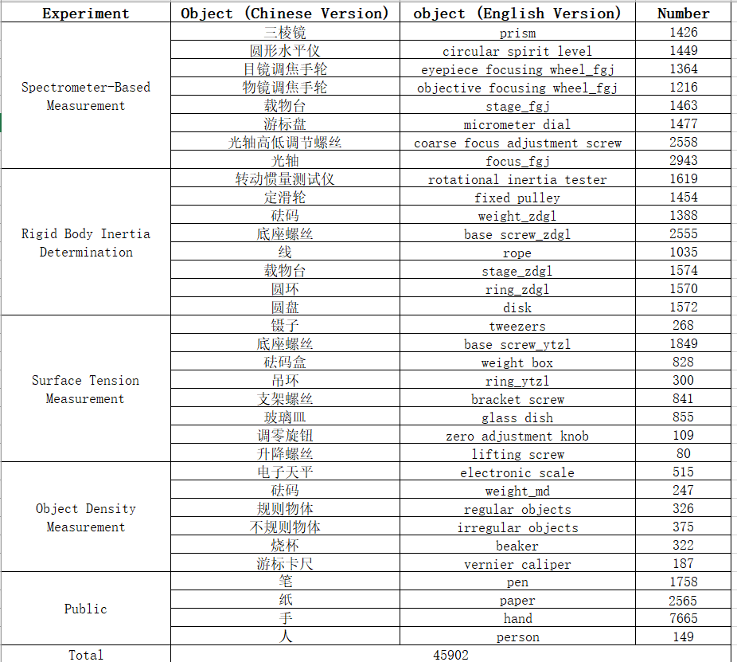
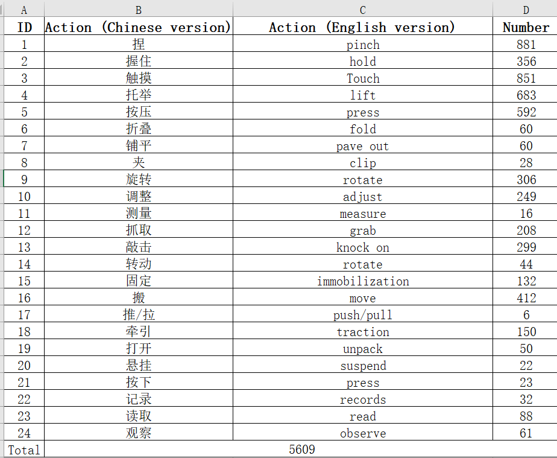

# 📥 PhysScene dataset:

## Experimental Manual

**We are using "University Physics Experiments" published by China University of Mining and Technology Press, which is a textbook for the "13th Five-Year Plan" of higher education and has been widely used.**

**The manual details many experiments, including an introduction to the experiments, experimental purposes, content, operation steps, and tips.**

  

**Below is a sample manual for measuring the density of an object. For details on other experiments, please visit this manual.**

  

  

  

## Experimental Types
- **Object Density Measurement**
- **Spectrometer-Based Measurement**
- **Surface Tension Measurement**
- **Rigid Body Inertia Determination**

## Details of Object and relation

  

  

  

## Collection Setting
## Dowload
- **Images can be download at [Here](https://drive.google.com/file/d/1WRcpXzVsI597LmUPnG0YXL2rx3aK_00a/view?usp=sharing)!**
- **Annotations can be download at [Here](https://drive.google.com/file/d/1yhih6c3b5LQTz54PTSNnML-18Myx7Psu/view?usp=drive_link)!**

## 🔧 CM-DPG model:
- **The code will be coming soon!**
