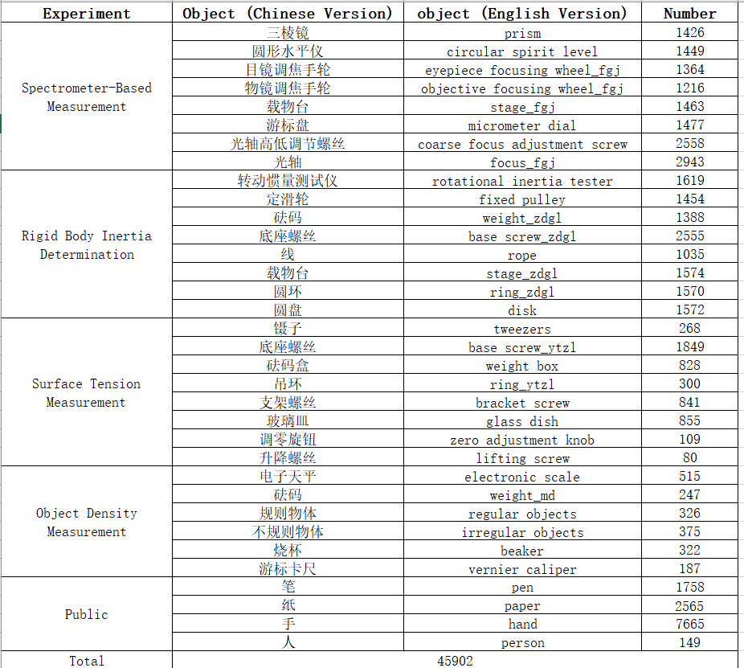
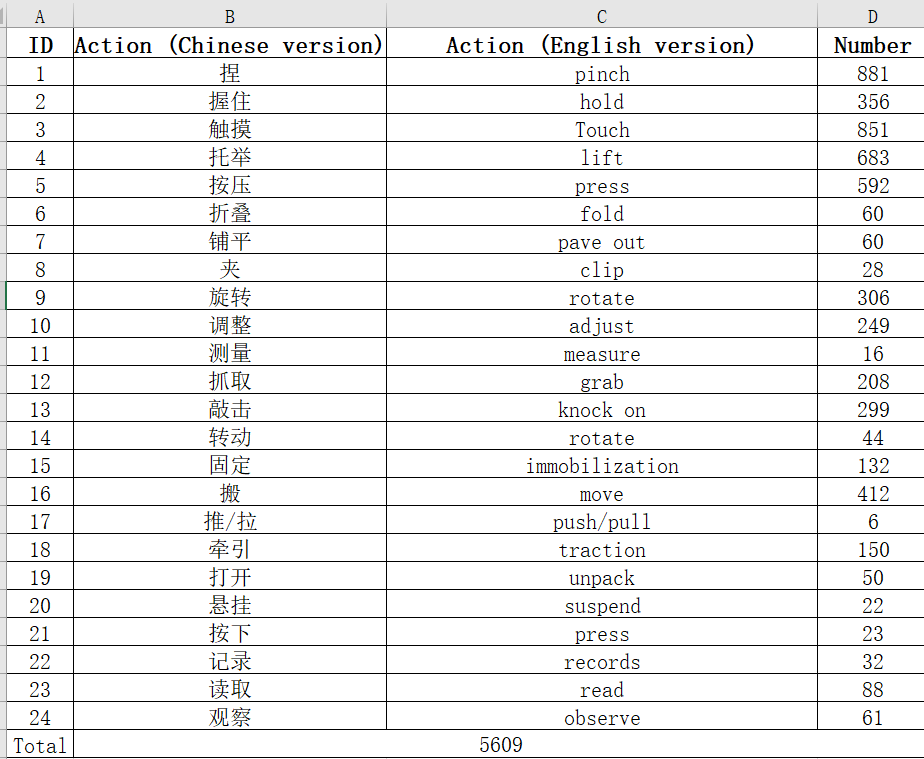
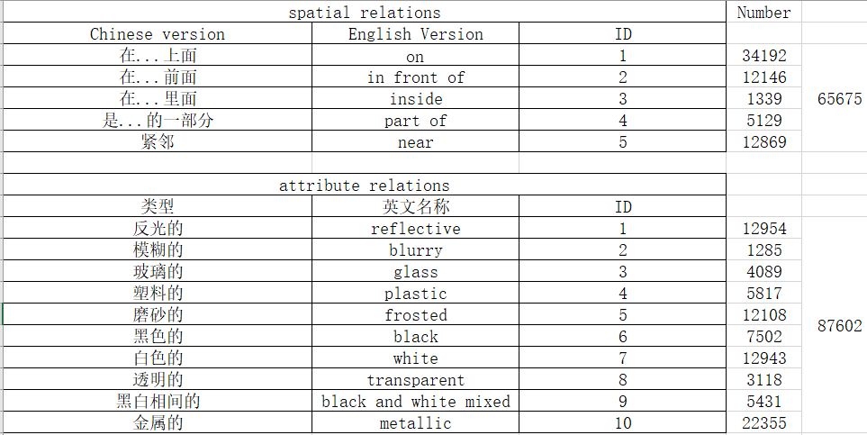

# 📥 1. PhysScene dataset

## 📘 Experimental Manual

**We adopt the textbook “University Physics Experiments” published by China University of Mining and Technology Press, a widely used “13th Five-Year Plan” higher-education textbook in China.**

**The manual includes comprehensive descriptions of physics experiments:**

- 🧰 **Experimental instrument**
- 🎯 **Experimental purpose**
- 🧪 **Experimental content**
- ▶️ **Operational procedures**
- ⚠️ **Precautions and notes**

**The following figure shows the cover of the *University Physics Experiments* manual and a summary page of one representative experiment. These pages illustrate the structured descriptions—purposes, instruments, procedures, and operation flows—that serve as the foundation for the PhysScene dataset design and annotation.**

<p align="center">
  
</p>

## 🔍 Sample Manual for the Object Density Measurement Experiment

**To view the full instructions for all experiments, please refer to the complete manual.**

**Below is a sample set of pages from the manual.**

<p align="center">
  
</p>
<p align="center">
  
</p>
<p align="center">
  
</p>

## 🧪 Experimental Categories

**Our dataset covers 4 fundamental physics experiments:**

- **Object Density Measurement**
- **Spectrometer-Based Measurement**
- **Surface Tension Measurement**
- **Rigid Body Inertia Determination**

## 🧱 Objects & Relations Overview

<p align="center">
  
</p>
<p align="center">
  
</p>
<p align="center">
  
</p>

## 🎥 Collection Settings
- **To ensure high-quality and diverse visual data, we collected images across various laboratory environments with differences in angle, lighting, operator behavior, and experiment configurations.**
- **A multi-stage data cleaning pipeline was applied to remove blurry, obstructed, out-of-focus, and duplicated samples.**
- **The figure below provides a visual overview of these components.**

<p align="center">
  
</p>


## ⬇️ Download Links

| Type        | Link |
|-------------|------|
| **Images**      | 👉 [Download Here](https://drive.google.com/file/d/1TFqrm0HJSXRIGNiXXGiQIR3Qp6FmW4M9/view?usp=sharing) |
| **Annotations** | 👉 [Download Here](https://drive.google.com/file/d/1yhih6c3b5LQTz54PTSNnML-18Myx7Psu/view?usp=drive_link) |

## 👪 Team
**Data collection and annotation were led by Minghao Zou, with contributions from Aihang Jiang, Chenxi Zhao, Rui Cao, Fan Zhao, Xianwei Lu, Xiangdong Long, Wenjing Liu, Canchen Zhang, Wenbo Bai, Ruijun Guo, Rongkun Wang, and Jia Pu.**

**We also extend our sincere gratitude to Yongping Miao, director of the Physics Experiment Center, for his invaluable guidance throughout the entire process.**

# 📥  2. Baselines

**We benchmarked 11 open-source Scene Graph Generation (SGG) models on the PhysScene dataset.**

**The `./Baselines` directory provides the official resources for all evaluated models, including:**

- **project websites or code repositories;**
- **corresponding papers;**
- **citation information.**

**All baseline models were evaluated using the benchmark settings specified in their official implementations.**

**The `./Baselines/Experimental Settings.md` file documents the details of our experimental setup, including:**

- **hyperparameter configuration;**
- **experimental hardware;**
- **data splitting details for Cs-SGG, OvD-SGG, and OvR-SGG settings.**

# 📥 3. CM-DPG model

## Setup

Install PyTorch and project dependencies:

```bash
pip install torch==1.9.1+cu111 torchvision==0.10.1+cu111 torchaudio==0.9.1 -f https://download.pytorch.org/whl/torch_stable.html
pip install -r requirements.txt
```

Install the local GroundingDINO package:

```bash
cd GroundingDINO && python3 setup.py install
cd ..
```

Download GroundingDINO pretrained weights:

```bash
mkdir -p $PWD/GroundingDINO/weights/
wget https://github.com/IDEA-Research/GroundingDINO/releases/download/v0.1.0-alpha/groundingdino_swint_ogc.pth -O $PWD/GroundingDINO/weights/groundingdino_swint_ogc.pth
wget https://github.com/IDEA-Research/GroundingDINO/releases/download/v0.1.0-alpha2/groundingdino_swinb_cogcoor.pth -O $PWD/GroundingDINO/weights/groundingdino_swinb_cogcoor.pth
```
## Dataset Preparation

### Annotation Conversion

Convert raw PhysScene annotations into this project's scene-graph format (take HOI as an example):

```bash
python tools/convert_phys_scene.py \
  --raw_root /path/to/raw_phys_scene \
  --output_root data/phys_scene
```

The conversion should generate:

```text
data/phys_scene/images/
data/phys_scene/annotations/phys_scene_all.json
data/phys_scene/annotations/phys_scene_dict.json
```

If `phys_scene_all.json` and `phys_scene_dict.json` already exist, this conversion step can be skipped.

Each item in `phys_scene_all.json` should contain fields like:

```json
{
  "image_id": 1,
  "image_key": "10_13_1.jpg",
  "source_img_id": 1,
  "original_file_name": "10_13_1.jpg",
  "file_name": "images/10_13_1.jpg",
  "width": 640,
  "height": 480,
  "boxes": [[x1, y1, x2, y2]],
  "labels": [1],
  "edges": [[0, 1, 3]]
}
```

Where:

- `boxes` are object bounding boxes in `[x1, y1, x2, y2]` format.
- `labels` are object category IDs.
- `edges` are relation triplets in `[subject_index, object_index, predicate_id]` format.
- `file_name` is relative to `data/phys_scene/`.

After preparation, PhysScene should follow this structure:

```text
data/phys_scene/
+-- images/
|   +-- 10_13_1.jpg
|   +-- 10_13_2.jpg
|   +-- ...
+-- annotations/
    +-- phys_scene_all.json
    +-- phys_scene_train.json
    +-- phys_scene_test.json
    +-- phys_scene_dict.json
```

### Train/Test Split

PhysScene train/test splits are generated from the image list using a deterministic random seed.

Default settings:

```python
phys_scene_split_seed = 1234
phys_scene_test_ratio = 0.2
phys_scene_regenerate_split = False
```

The split generation produces:

```text
data/phys_scene/annotations/phys_scene_train.json
data/phys_scene/annotations/phys_scene_test.json
```

`phys_scene_all.json` remains unsplit and should not include `split`.

To regenerate the split with a different seed or ratio, update the config or pass options at runtime:

```bash
--options \
  phys_scene_split_seed=2025 \
  phys_scene_test_ratio=0.2 \
  phys_scene_regenerate_split=True
```

The split is generated by `util/phys_scene_split.py`. The dataset loader calls this automatically when PhysScene is selected.

### Frequency Bias Statistics

OvSGTR can use a VG-style relation frequency-bias file through `rln_freq_bias`.
For PhysScene, generate a dataset-specific file from the training split:

```bash
python tools/generate_phys_scene_stats.py \
  --annotation-file data/phys_scene/annotations/phys_scene_train.json \
  --dict-file data/phys_scene/annotations/phys_scene_dict.json \
  --output-file data/phys_scene/phys_scene_stats.pt
```

The generated file contains:

```text
fg_matrix
pred_dist
obj_classes
rel_classes
```

`pred_dist` follows the VG logic:

```python
pred_dist = log(fg_matrix / fg_matrix.sum(2)[:, :, None] + 1e-3)
```

Use only the training split to generate this file. Do not build it from `phys_scene_all.json`.

## Training

### CS-SGG on PhysScene

Use the common CS-SGG config and select PhysScene through command-line arguments:

```bash
python main.py \
  --output_dir ./logs/phys_scene_cs_sgg \
  -c ./config/GroundingDINO_SwinT_Cs-SGG.py \
  --data_path ./data/phys_scene \
  --dataset_file phys_scene \
  --pretrain_model_path ./GroundingDINO/weights/groundingdino_swint_ogc.pth \
  --num_workers 0 \
  --seed 1234 \
  --options \
    batch_size=4 \
    num_rln_cat=27 \
    rln_freq_bias=data/phys_scene/phys_scene_stats.pt \
    phys_scene_split_seed=1234 \
    phys_scene_test_ratio=0.2 \
    phys_scene_regenerate_split=False
```

### Original VG CS-SGG

For Visual Genome, keep the VG data path and VG-specific options:

```bash
python main.py \
  --output_dir ./logs/ovsgtr_vg_swint_full \
  -c ./config/GroundingDINO_SwinT_Cs-SGG.py \
  --data_path ./data \
  --dataset_file vg \
  --pretrain_model_path ./GroundingDINO/weights/groundingdino_swint_ogc.pth \
  --num_workers 0 \
  --seed 1234 \
  --options \
    dn_scalar=100 \
    embed_init_tgt=TRUE \
    dn_label_coef=1.0 \
    dn_bbox_coef=1.0 \
    use_ema=False \
    dn_box_noise_scale=1.0 \
    eval_before_train=False \
    batch_size=4
```

## Evaluation

Evaluate a trained PhysScene checkpoint:

```bash
python main.py \
  --eval \
  --resume ./logs/phys_scene_cs_sgg/checkpoint.pth \
  --output_dir ./logs/phys_scene_cs_sgg_eval \
  -c ./config/GroundingDINO_SwinT_Cs-SGG.py \
  --data_path ./data/phys_scene \
  --dataset_file phys_scene \
  --num_workers 0 \
  --seed 1234 \
  --options \
    num_rln_cat=27 \
    rln_freq_bias=data/phys_scene/phys_scene_stats.pt \
    phys_scene_split_seed=1234 \
    phys_scene_test_ratio=0.2 \
    phys_scene_regenerate_split=False
```

## Notes

- `--dataset_file phys_scene` selects the PhysScene dataset reader.
- `--data_path ./data/phys_scene` should point to the PhysScene dataset root.
- `num_rln_cat` must match the number of relation categories in `phys_scene_dict.json`.
- `rln_freq_bias=data/phys_scene/phys_scene_stats.pt` enables the PhysScene subject-object predicate prior.
- `phys_scene_all.json` is the unsplit full annotation file.
- `phys_scene_train.json` is used for training and predicate-frequency reweighting.
- `phys_scene_test.json` is used only for validation/testing.
- Changing `phys_scene_split_seed` changes the train/test partition after regeneration.
